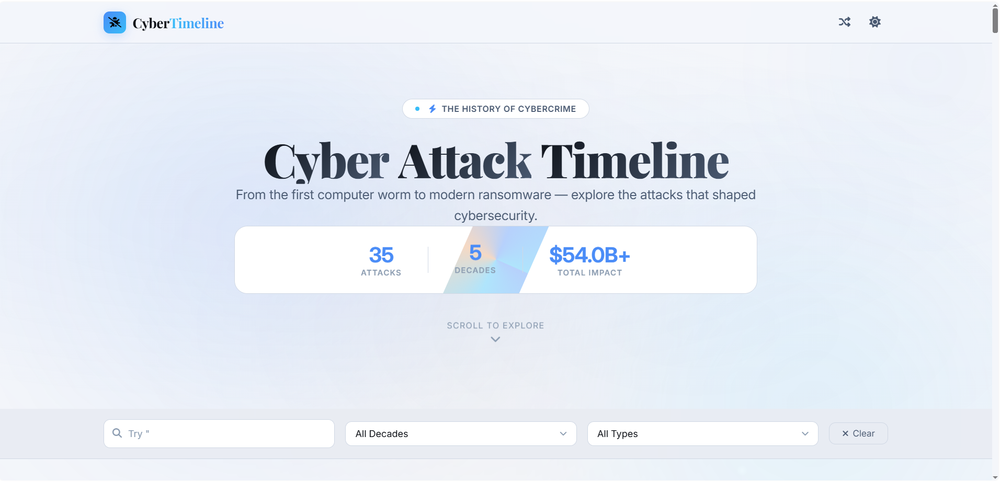

<h1 align="center">Cyber Attack Timeline</h1>

<p align="center">
  <strong>35 real cyberattacks. 5 decades. Told like stories, not spreadsheets.</strong><br>
  From the very first internet worm in 1988 to the Foxconn ransomware attack in 2026 — explained simply, so anyone can understand what actually happened and why it matters.
</p>

<div align="center">
  
</div>

<p align="center">
  <a href="https://breach-timeline-kappa.vercel.app/">
    
  </a>
  
  
</p>

<p align="center">
  
  
  
  
  
</p>

<p align="center">
  
  
  
  
  
  
</p>


> **You don't need to be a hacker or a security expert to enjoy this. If you've ever been curious about how the internet's biggest break-ins happened, this is for you.**

<p align="center">
  
</p>

---

<details>
<summary><b>📑 Table of Contents</b></summary>
<br>

- [🚀 Try It Right Now](#-try-it-right-now)
- [💡 Why I Made This](#-why-i-made-this)
- [🛠️ What It's Built With](#%EF%B8%8F-what-its-built-with)
- [📁 Inside the Project](#-inside-the-project)
- [⚡ Run It On Your Own Computer](#-run-it-on-your-own-computer)
- [📚 What You'll Find Inside](#-what-youll-find-inside)
- [🤝 Want to Help?](#-want-to-help)
- [📄 License](#-license)
- [👤 Who Made This](#-who-made-this)

</details>

---

## 🚀 Try It Right Now

**[👉 Open Breach Timeline](https://breach-timeline-kappa.vercel.app/)**

No downloads. No account. No email asked. No tracking in the background.

Just click the link, type in an attack you've heard of (or haven't), filter by decade or attack type if you're in the mood for a specific era, and tap any card to read the full story — written so it's actually enjoyable to read, not something you skim and forget.

---

## 💡 Why I Made This

I'm not a cybersecurity expert. I'm self-taught, learning the way most people actually learn this stuff — one write-up at a time, usually at 1 AM, falling down a Google rabbit hole because one article led to another.

And I kept hitting the same wall over and over: the history of cyberattacks is genuinely one of the most interesting parts of this whole field, but almost nothing about it is written for someone who's just starting out. It's scattered across a thousand technical blogs, dense Wikipedia pages, and YouTube videos that assume you already know half the vocabulary.

So I decided to build the thing I wish existed when I was starting out.

Not a boring list of dates. Something you can actually sit down with — search for an attack, filter it, open a card, and find out *why* the Morris Worm even happened, *how* Stuxnet managed to physically destroy machinery from across the internet, and *what one small decision* turned the Colonial Pipeline hack into a country-wide fuel shortage.

Here's the part that matters most, though: the tricks behind these massive, headline-making attacks are the exact same tricks used against regular, everyday people all the time — phishing emails, reused passwords, skipped software updates, weak or missing two-factor authentication. Once you understand how the "big ones" happened, you start noticing the same warning signs in your own inbox.

**You do not need a technical background to enjoy this site, and you don't need one to read this page either.** If a word or a term trips you up while you're reading, treat that as a little nudge to go look it up — not a sign that this isn't meant for you. Everyone starts somewhere, and this handbook was built with exactly that person in mind.


## 🛠️ What It's Built With

The site started as plain HTML/CSS/JS and has since been rebuilt on Next.js for faster loads, real type safety, and a component structure that's actually easy to extend.

| | |
|---|---|
| 🧱 **Framework** | [Next.js 16](https://nextjs.org/) (App Router, Turbopack) on [React 19](https://react.dev/) |
| 🔒 **Type Safety** | [TypeScript](https://www.typescriptlang.org/) — every attack, FAQ, and tip is a typed data record, not a loose JSON blob |
| 🎨 **Styling** | [Tailwind CSS](https://tailwindcss.com/) with a small custom design system (aurora background, dark/light themes via [next-themes](https://github.com/pacocoursey/next-themes)) |
| 🎬 **Animation** | [Framer Motion](https://www.framer.com/motion/) for staggered reveals, the animated stats chart, and the scroll progress bar |
| 🎨 **Icons & Fonts** | [Lucide](https://lucide.dev/) for icons, Google Fonts (via `next/font`) for typography |
| ☁️ **Where It Lives** | Deployed on [Vercel](https://vercel.com/) as a fully static, prerendered site — no database, no API routes, nothing that can break |

One `npm install`, one `npm run dev`. No config to hand-edit before it runs.

---

## 📁 Inside the Project

```text
Breach-Timeline/
│
├── public/
│   └── screenshot.png
│
├── src/
│   ├── app/
│   │   ├── layout.tsx        # root layout, fonts, theme provider
│   │   ├── page.tsx           # assembles all sections
│   │   └── globals.css        # design tokens, aurora background
│   │
│   ├── components/            # Hero, Navbar, Filters, Timeline,
│   │                           # TimelineCard, StatsChart, Tips,
│   │                           # Protect, Faq, Footer, etc.
│   │
│   ├── data/                  # typed attack, FAQ, and tip records
│   │   ├── attacks.ts
│   │   ├── faqs.ts
│   │   ├── protect.ts
│   │   └── tips.tsx
│   │
│   └── lib/
│       └── utils.ts
│
├── package.json
├── tailwind.config.ts
├── tsconfig.json
├── README.md
└── LICENSE
```

Every section on the page is its own component under `src/components/`, and every piece of content lives in a typed file under `src/data/` — so adding a new attack means editing one array, not hunting through HTML.

---

## ⚡ Run It On Your Own Computer

```bash
git clone https://github.com/priyanshu-rawa/Breach-Timeline.git
cd Breach-Timeline

npm install
npm run dev
```

Then open `http://localhost:3000` in your browser.

Other useful commands:

```bash
npm run build   # production build
npm run start   # serve the production build locally
npm run lint    # run ESLint
```

---

## 📚 What You'll Find Inside

Five decades of history. 35 real incidents, each one explained in plain language.

<div align="center">

| Decade | Attacks Covered |
|:------:|:---------:|
| 🕹️ 1980s | 2 |
| 💾 1990s | 2 |
| 🌐 2000s | 6 |
| 📱 2010s | 15 |
| ☁️ 2020s | 10 |

</div>

It starts all the way back with the Morris Worm, the AIDS Trojan, and the Melissa Virus — some of the earliest cyberattacks in history. From there it moves into Stuxnet (which physically destroyed nuclear centrifuges), WannaCry and NotPetya (two of the most damaging ransomware outbreaks ever), and the SolarWinds attack, which changed how the entire security industry thinks about trust in software supply chains. It closes out right up to 2025 and 2026, covering the Marks & Spencer, Jaguar Land Rover, and Foxconn breaches.


## 🤝 Want to Help?

You genuinely don't need to be an expert to contribute — this project gets better every single time someone points out something I missed or explains it better than I did.

```bash
git clone https://github.com/YOUR-USERNAME/Breach-Timeline.git
cd Breach-Timeline
npm install

git checkout -b improve-timeline
# make your changes
git add .
git commit -m "Improve timeline information"
git push origin improve-timeline
```

Once you're ready, open a pull request. Here are a few easy ways to help:

- Spot a major breach that's missing? Add it to `src/data/attacks.ts`.
- Notice a date or detail that's gone out of date? Fix it.
- Have an eye for accessibility or mobile design? Improve it.
- Know how to make an animation feel smoother? Refine it in the relevant component.
- Found a typo or a confusing sentence in these docs? Clean it up.

Not sure if your idea's a good fit? Open an issue first and ask — that's always welcome, no question is too small.

A few friendly guidelines before you submit a pull request: keep your changes focused on one thing at a time, try to match the existing visual style, run `npm run build` before pushing to make sure nothing's broken, avoid adding new dependencies unless there's a real need for them, test your changes on both desktop and mobile, and write clear commit messages. If you're adding a historical fact, please link a reliable source for it. The whole point of this project is to stay simple and easy for the next person to learn from — let's keep it that way.

---

## 📄 License

This project is open source. Check the [LICENSE](LICENSE) file for the full details.

---

## 👤 Who Made This

<div align="center">

**Priyanshu**

Self-taught, still learning every day — building this as my own way of understanding cybersecurity history properly, and hoping it makes the subject feel a little less intimidating for the next person starting exactly where I once did.

<a href="https://github.com/priyanshu-rawa">
  
</a>

</div>

---

<div align="center">

### ⭐ Star History

<a href="https://star-history.com/#priyanshu-rawa/Breach-Timeline&Date">
  
</a>

</div>

---

<div align="center">

If this project taught you something new, or you simply enjoyed exploring it, a star would genuinely mean a lot. This project is brand new with no history behind it yet — every single star is how the next curious person actually finds their way here.

**[⭐ Star this repo](https://github.com/priyanshu-rawa/Breach-Timeline)** · **[🐛 Report an issue](https://github.com/priyanshu-rawa/Breach-Timeline/issues)** · **[🔀 Open a pull request](https://github.com/priyanshu-rawa/Breach-Timeline/pulls)**

</div>


