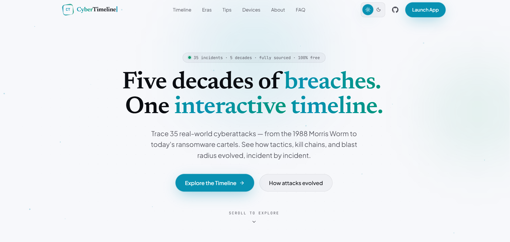

<div align="center">

# CyberTimeline

**35 real cyberattacks, 5 decades, one interactive timeline.**

[](https://nextjs.org/)
[](https://www.typescriptlang.org/)
[](https://tailwindcss.com/)
[](https://motion.dev/)
[](https://creativecommons.org/licenses/by/4.0/)

**[Live Site](https://breach-timeline-kappa.vercel.app/) · [Explore the Timeline](https://breach-timeline-kappa.vercel.app/#timeline)**

</div>

<p align="center">
  
</p>

---

## About

CyberTimeline walks through major cybersecurity incidents from the 1980s to today, instead of treating them as one-off news stories. Put side by side, incidents like the Morris Worm, SQL Slammer, Stuxnet, WannaCry, NotPetya, and SolarWinds make the recurring causes easier to spot: weak credentials, phishing, unpatched software, misconfiguration, excessive privileges, and supply-chain trust. A lot of it still shows up in breaches today.

Useful if you're studying security, learning blue team/SOC basics, or just curious how a major breach actually happened.

## What's inside

**Timeline** — 35 incidents from the 1980s through the 2020s: The 414s, Morris Worm, Kevin Mitnick, Melissa, ILOVEYOU, SQL Slammer, Conficker, GhostNet, Stuxnet, Equifax, WannaCry, NotPetya, SolarWinds, Log4Shell, the XZ Utils backdoor, and more. Each one has structured details so you can compare across eras.

**Attack patterns** — groups incidents by root cause (credentials & phishing, unpatched vulnerabilities, supply chain & trust) to show how the same weaknesses keep coming back.

**Device protection** — practical hardening notes for Windows, macOS, iOS, and Android: password managers, MFA, backups, browsers, VPNs. Points to free, reputable tools rather than pushing products.

**Security tips & FAQ** — everyday advice plus answers to common questions about the incidents and how to defend against similar attacks.

## Tech stack

| Technology         | Purpose                                      |
| ------------------ | --------------------------------------------- |
| Next.js 16         | React framework and app architecture         |
| React 19           | UI                                            |
| TypeScript 5.9     | Type-safe development                        |
| Tailwind CSS 4     | Styling and design system                    |
| Framer Motion      | Animations and motion                        |
| Lucide React       | Icons                                         |
| Drizzle ORM        | Database layer                               |
| PostgreSQL         | Database                                      |
| ESLint             | Linting                                       |

## Project structure

```text
src/
├── app/
│   ├── api/
│   │   ├── health/
│   │   │   └── route.ts
│   │   └── incidents/
│   │       └── route.ts
│   ├── globals.css
│   ├── layout.tsx
│   └── page.tsx
│
├── components/
│   ├── Benefits.tsx
│   ├── CTASection.tsx
│   ├── DeviceProtection.tsx
│   ├── Evolution.tsx
│   ├── FAQ.tsx
│   ├── Features.tsx
│   ├── Footer.tsx
│   ├── HelpfulTips.tsx
│   ├── Hero.tsx
│   ├── IncidentCard.tsx
│   ├── Navbar.tsx
│   ├── OpenAccess.tsx
│   ├── StatsBar.tsx
│   ├── Timeline.tsx
│   └── WhyIBuiltThis.tsx
│
├── data/
│   ├── devices.ts
│   ├── faq.ts
│   ├── incidents.ts
│   ├── nav.ts
│   ├── site.ts
│   └── tips.ts
│
├── db/
│   ├── index.ts
│   └── schema.ts
│
└── ui/
    ├── BackToTop.tsx
    ├── CursorGlow.tsx
    ├── GlassCard.tsx
    ├── GradientText.tsx
    ├── Logo.tsx
    ├── Magnetic.tsx
    ├── Reveal.tsx
    ├── ScrollProgress.tsx
    ├── SectionHeading.tsx
    ├── SplitText.tsx
    ├── ThemeToggle.tsx
    ├── Ticker.tsx
    ├── icons.tsx
    ├── motion.ts
    └── theme.tsx
```

Content lives separately from UI. Incident data is in `src/data/incidents.ts`, so fixing or adding an incident doesn't mean touching the interface.

## Getting started

```bash
git clone https://github.com/priyanshu-rawa/Breach-Timeline.git
cd Breach-Timeline
npm install
npm run dev
```

Then open [http://localhost:3000](http://localhost:3000).

## Commands

| Command             | What it does                        |
| ------------------- | ------------------------------------ |
| `npm run dev`        | Start the dev server                |
| `npm run build`       | Production build                    |
| `npm run start`       | Run the production build            |
| `npm run typecheck`   | Type-check without emitting files   |
| `npm run lint`        | Run ESLint                          |

Run `typecheck`, `lint`, and `build` before opening a PR.

## Contributing

**Fixing an incident:** edit `src/data/incidents.ts`, keep the description short, and link a reliable source (government advisory, court filing, vendor postmortem, original research, solid journalism) in your PR. Flag financial figures as estimates where they are. Prefer the original source over a secondary article covering it.

**Adding an incident:** good candidates had a real, lasting effect on security practices, research, or policy, not just news coverage at the time.

## Sources

Built from public advisories, court filings, vendor reports, and reputable reporting, with reference to [MITRE ATT&CK](https://attack.mitre.org/) and [Privacy Guides](https://www.privacyguides.org/). Spot an attribution or factual error? Open an issue or a PR.

Cyberattack numbers (losses, victims, systems affected) are often disputed between sources. Figures are marked as estimates where that's the case, and corrected when a later investigation or disclosure revises them.

No account is needed to use the site, and there's no data collection beyond what's needed to run it.

## License

Code is MIT. The incident dataset is [CC BY 4.0](https://creativecommons.org/licenses/by/4.0/) — reuse and adapt it with attribution.

## Author

Built by **Priyanshu Rawat**, originally as a way to learn cybersecurity through real-world attack history.

If it's useful, a star helps, and bug reports / PRs are welcome.

[GitHub Repository](https://github.com/priyanshu-rawa/Breach-Timeline)
