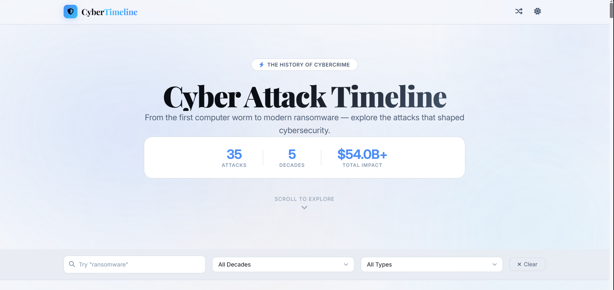

<h1 align="center">🕸️ Cyber Attack Timeline</h1>

<p align="center">
  <strong>Breach Timeline</strong> — a visual journey through some of the cyber attacks that shaped modern cybersecurity.
</p>

<p align="center">
  <a href="https://priyanshu-rawa.github.io/Breach-Timeline">Live Demo</a> •
  <a href="https://github.com/priyanshu-rawa/Breach-Timeline">Source Code</a>
</p>

<p align="center">
  
  
  
  
  
  
  
</p>

> **From the first internet worms to modern ransomware operations — explore how cyber attacks evolved, what they changed, and why they still matter.**



---

## 🌐 Live Demo

Explore the full interactive timeline:

**[→ Open Breach Timeline](https://priyanshu-rawa.github.io/Breach-Timeline)**

The project is completely browser-based, so there is nothing to install. Open it, search for an attack, filter the timeline, and explore.

---

## 🧠 Why I Built This

When learning cybersecurity, I kept coming across the same problem: there is a huge amount of information about famous cyber attacks, but most of it is scattered across articles, reports, videos, and security blogs.

It is easy to learn what an attack did. It is harder to see **how attacks changed over time**.

I wanted a simple way to look at that history in one place — from the Morris Worm in 1988 to modern operations such as Operation ENDGAME.

That idea became **Breach Timeline**.

Instead of presenting the incidents as a long list of dates, I wanted to make them something you could actually explore. You can search by attack name, filter by decade or attack type, see the overall statistics, and move through the timeline at your own pace.

It is also a small experiment in building a polished frontend using nothing more than HTML, CSS, and vanilla JavaScript.

The goal is not to document every attack ever discovered. It is to make some of the important moments in cybersecurity history easier to understand and remember.

**History doesn't repeat itself. But it often rhymes.**

---

## ⚡ Features

| Feature                  | What it does                                             |
| :----------------------- | :------------------------------------------------------- |
| 🗓️ Interactive Timeline | Explore major cyber attacks from 1988 through 2025       |
| 🔎 Search & Filtering    | Find attacks by name, decade, or attack type             |
| 📊 Live Statistics       | See total attacks, decades covered, and estimated impact |
| 🌙 Dark / Light Mode     | Switch between themes depending on your preference       |
| 🖱️ Custom Cursor        | Adds interactive hover effects throughout the interface  |
| ✨ Dynamic Starfield      | Animated background for a more immersive experience      |
| 📈 Scroll Progress       | Shows your position while exploring the timeline         |
| 🔗 Share Button          | Quickly share the project with others                    |
| ⌨️ Keyboard Shortcuts    | `Ctrl + K` opens search and `Esc` clears filters         |
| 📱 Responsive Design     | Works across desktop, tablet, and mobile screens         |

---

## 🛠️ Tech Stack

| Technology             | Purpose                                                             |
| :--------------------- | :------------------------------------------------------------------ |
| **HTML5**              | Page structure and semantic content                                 |
| **CSS3**               | Layout, animations, themes, responsive design                       |
| **Vanilla JavaScript** | Timeline rendering, filtering, search, statistics, and interactions |
| **Font Awesome**       | Icons throughout the interface                                      |
| **Google Fonts**       | Inter and JetBrains Mono typography                                 |
| **GitHub Pages**       | Static site hosting                                                 |

No frameworks. No build system. No unnecessary dependencies.

Just HTML, CSS, and JavaScript.

---

## 📁 Project Structure

```text
Breach-Timeline/
│
├── assets/
│   └── screenshot.png
│
├── index.html
├── style.css
├── script.js
├── README.md
└── LICENSE
```

The project is intentionally simple so that it is easy to understand, modify, and contribute to.

---

## 🚀 Getting Started

Want to run it locally?

### 1. Clone the repository

```bash
git clone https://github.com/priyanshu-rawa/Breach-Timeline.git
```

### 2. Enter the project directory

```bash
cd Breach-Timeline
```

### 3. Open the project

You can simply open `index.html` in your browser.

Or, if you prefer using a local server:

```bash
python -m http.server 8000
```

Then open:

```text
http://localhost:8000
```

That's it.

There is no `npm install`, build step, or framework setup required.

---

## 📚 Data Overview

The timeline currently covers major incidents across five decades.

| Decade    | Major incidents covered |
| :-------- | :---------------------: |
| **1980s** |            2            |
| **1990s** |            2            |
| **2000s** |            7            |
| **2010s** |            11           |
| **2020s** |            7            |
| **Total** | **29 listed incidents** |

### Incidents Included

#### 1980s

* Morris Worm
* AIDS Trojan

#### 1990s

* Melissa Virus
* Chernobyl Virus

#### 2000s

* MafiaBoy DDoS
* Code Red
* SQL Slammer
* MyDoom
* Operation Aurora
* Conficker
* Stuxnet

#### 2010s

* Sony PlayStation Hack
* LinkedIn Breach
* Yahoo Breach
* Sony Pictures Hack
* OPM Breach
* DNC Email Leak
* WannaCry
* NotPetya
* Cambridge Analytica
* Marriott Breach
* Capital One Breach

#### 2020s

* SolarWinds
* Colonial Pipeline Ransomware
* Log4j
* Uber Breach
* Clorox Ransomware
* Change Healthcare Ransomware
* Operation ENDGAME

> The incident list above currently contains **29 entries**. The project description originally referred to 27, so the README follows the actual entries listed in the timeline.

---

## 🔍 What You Can Explore

The timeline is designed around a few simple questions:

* **When did this happen?**
* **What type of attack was it?**
* **Who or what was affected?**
* **How large was the impact?**
* **How did attacks evolve over the years?**

You can start with the earliest incidents and move forward, or jump directly to a specific attack using the search and filters.

---

## 💡 Why This Project Matters

Cybersecurity is often taught through individual technologies, vulnerabilities, and tools.

But attacks also have a history.

The Morris Worm showed how quickly malicious software could spread across connected systems. Later attacks demonstrated the growing importance of web applications, supply chains, identity, ransomware, industrial systems, and large-scale data breaches.

Looking at these incidents together makes one thing clear:

**Cybersecurity is constantly changing, but many of the underlying lessons remain familiar.**

Understanding that history can help put today's incidents into context. A new attack may use newer infrastructure or techniques, but the weaknesses behind it can sometimes look surprisingly familiar.

That is what this project is really about — not just remembering famous breaches, but seeing the patterns connecting them.

---

## 🤝 Contributing

Contributions are welcome.

If you notice an incorrect detail, have a useful historical incident to add, or want to improve the interface, feel free to contribute.

### Getting Started

1. Fork the repository.
2. Clone your fork.
3. Create a new branch.
4. Make your changes.
5. Test everything locally.
6. Commit your changes.
7. Open a pull request.

Example:

```bash
git clone https://github.com/YOUR-USERNAME/Breach-Timeline.git
cd Breach-Timeline

git checkout -b improve-timeline

git add .
git commit -m "Improve timeline information"

git push origin improve-timeline
```

### Good Contributions

Some areas where contributions are especially useful:

* Adding historically significant incidents
* Improving existing incident information
* Fixing incorrect dates or details
* Improving accessibility
* Improving mobile responsiveness
* Refining animations and interactions
* Fixing bugs
* Improving documentation

If you are unsure whether an idea fits the project, opening an issue first is completely fine.

---

## 📝 Contribution Guidelines

Before submitting a pull request:

* Keep changes focused.
* Keep the existing visual style consistent.
* Avoid adding unnecessary dependencies.
* Test changes on both desktop and mobile layouts.
* Make sure existing features still work.
* Use clear commit messages.
* For historical information, prefer reliable sources.

The project is meant to stay lightweight, readable, and easy for others to learn from.

---

## 📄 License

This project is open source and distributed under the license included in the repository.

See the [LICENSE](LICENSE) file for the full terms.

---

## 🔗 Links

| Resource             | Link                                                                                           |
| :------------------- | :--------------------------------------------------------------------------------------------- |
| 🌐 Live Demo         | [priyanshu-rawa.github.io/Breach-Timeline](https://priyanshu-rawa.github.io/Breach-Timeline)   |
| 💻 GitHub Repository | [github.com/priyanshu-rawa/Breach-Timeline](https://github.com/priyanshu-rawa/Breach-Timeline) |
| 🐛 Issues            | [Report an issue](https://github.com/priyanshu-rawa/Breach-Timeline/issues)                    |
| 🔀 Pull Requests     | [View pull requests](https://github.com/priyanshu-rawa/Breach-Timeline/pulls)                  |

---

## 👨‍💻 Author

**Priyanshu**

I built Breach Timeline as a personal cybersecurity project to combine two things I enjoy: learning how cyber attacks work and building things on the web.

If you find something that can be improved, feel free to open an issue or contribute.

**GitHub:** [@priyanshu-rawa](https://github.com/priyanshu-rawa)

---

## ⭐ Support the Project

If you found the timeline useful, learned something from it, or simply liked the project, consider giving the repository a star.

It helps the project get discovered by other people interested in cybersecurity and motivates me to keep improving it.

<div align="center">If this project helped you learn something new, drop a star ⭐ – it keeps me motivated to build more.</div>
